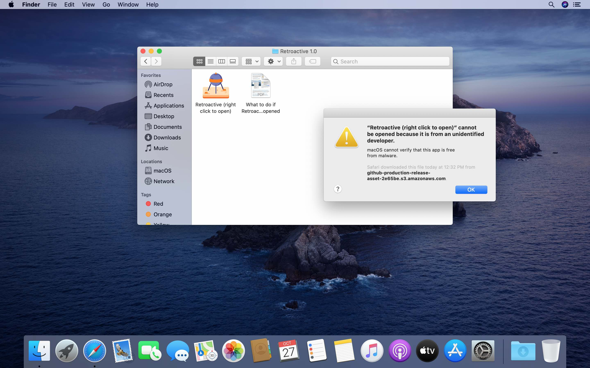
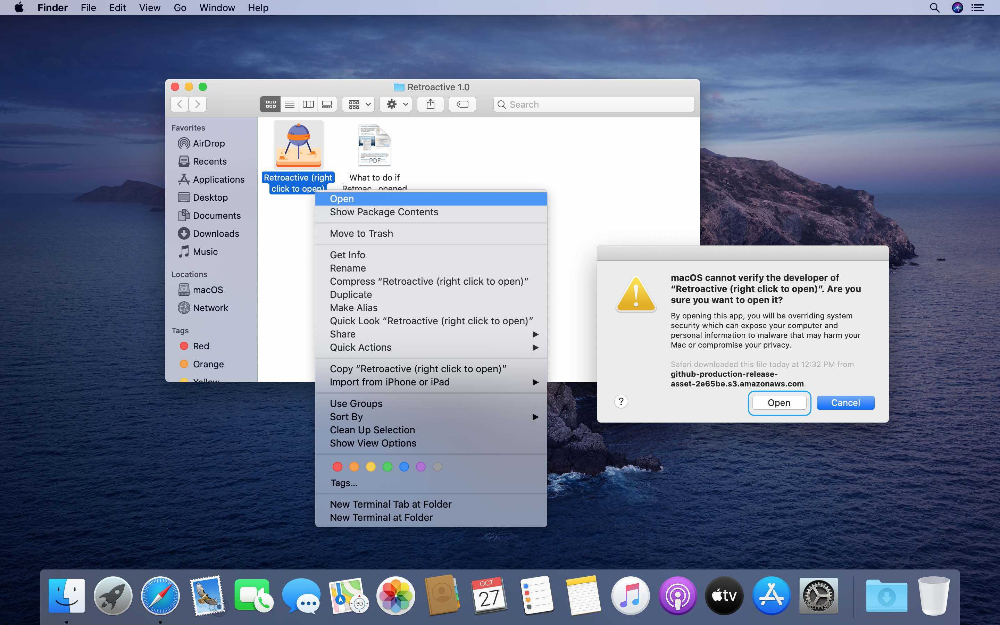
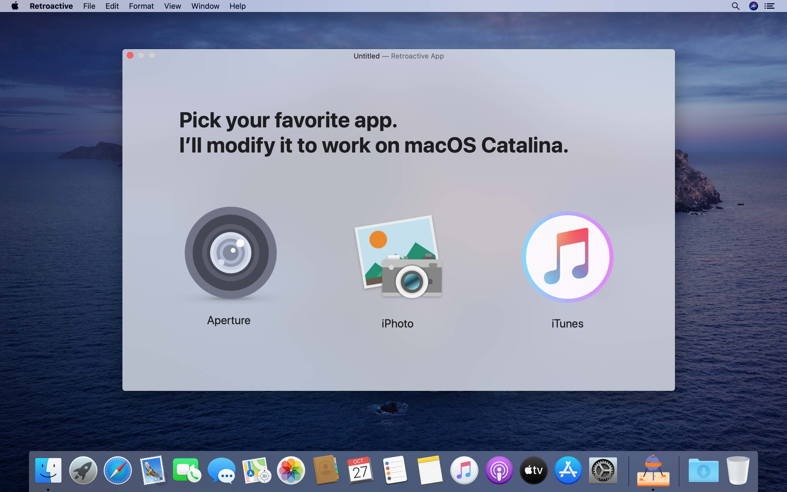
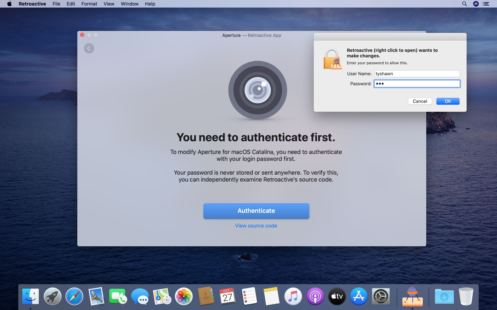
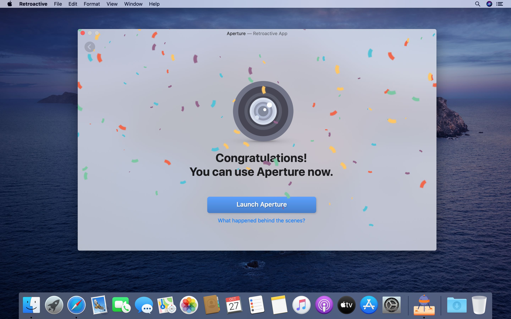
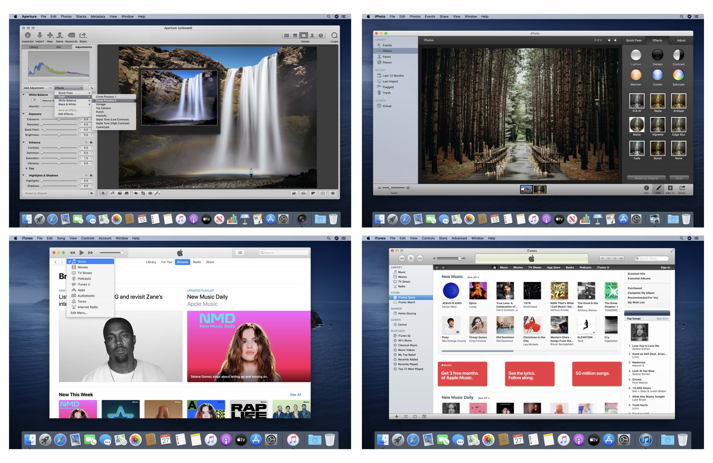

## Retroactive is an app that lets you run Aperture, iPhoto, and iTunes on macOS Catalina.

The Retroactive app can modify Aperture, iPhoto, and iTunes to run on macOS Catalina. [Directly download the Retroactive app here](https://github.com/cormiertyshawn895/Retroactive/releases/download/1.0/Retroactive.1.0.zip), or [from the release page](https://github.com/cormiertyshawn895/Retroactive/releases).

---

### Opening Retroactive

After downloading Retroactive, double click to open it. macOS may prompt you “Retroactive cannot be opened because it is from an unidentified developer.” This is completely normal and expected.

To open Retroactive, [right-click](https://support.apple.com/HT207700) on the Retroactive app in Finder, and click “Open” as shown below.

If you right-clicked when opening Retroactive for the first time, you need to [right-click](https://support.apple.com/HT207700) for a second time. If Retroactive still can’t be opened, [check your GateKeeper settings](https://support.apple.com/en-us/HT202491) under the General tab in System Preferences > Security & Privacy. Click “Open Anyway” to open Retroactive.

Retroactive will not harm your Mac. This alert only shows up because Retroactive is not notarized. Retroactive is open source, so you can always examine its source code to make sure it’s safe.

---

### Picking an app

This is obvious! Just pick the app you want to run on macOS Catalina. If you want to run multiple apps, just pick one for now. You will always be able to get back to this screen.

I’ll choose Aperture as the example here, but the same process also works for iPhoto and iTunes.

---

### Locating the app or choosing a version

Retroactive will automatically scan your Mac to locate an existing Aperture, iPhoto, or iTunes install. If Retroactive has already located the app you would like to run, skip to Step 5.

If Retroactive can’t locate an existing install, you’ll be asked to download it from the Purchased list in App Store. You can also find the app on another Mac you own, then AirDrop it to this Mac, or restore the app from a Time Machine backup.

Redownload Aperture and iPhoto from the Purchased list in App Store
If you chose iTunes, Retroactive will ask you which version to install, then automatically download and install it for you.

- iTunes 12.9.5 supports Dark Mode and most DJ apps.
- iTunes 12.6.5 supports downloading and archiving iOS apps.
- iTunes 10.7 (not recommended) supports CoverFlow.

If you don’t know which version to install, keep the default setting and click “Continue”.

---

### Authenticating Retroactive

To install or modify the app you chose, you need to authenticate with your login password first. Click “Authenticate”, and enter your login password.

Your password is never stored or sent anywhere. To verify this, you can view Retroactive’s source code.

---

### Modifying the app

Retroactive will install or modify the app you chose. Modifying Aperture and iPhoto to run on macOS Catalina should only take about 2 minutes.

If you chose to install iTunes, this process takes longer. Depending on the version you chose, it can take between 10 minutes to an hour. It is completely normal for the fans to spin up during the process.

If Retroactive asks for your login password again, enter it again. Otherwise, the iTunes installation may be damaged or incomplete. If iTunes 12.9.5 can’t be installed, try to install iTunes 12.6.5.

---

### Using the app

After successfully modifying or installing the app, you can play with it to your heart's content.

- All Aperture features should be available except for playing videos and exporting slideshows.

- All iPhoto features should be available except for playing videos and exporting slideshows. (iPhoto may automatically quit when playing video.)

- All features should work for iTunes 12.9.5 and iTunes 12.6.5. If you use iTunes 12.6.5 to download iOS apps, thumbnails may appear distorted.

- iTunes 10.7 may prompt “A required iTunes component is not installed. Please reinstall iTunes (-42401).” There is no need to reinstall iTunes.

---

### Last Words
- If GateKeeper prevents you from running modified versions of Aperture, iPhoto or iTunes, [temporarily disable GateKeeper in Terminal with `sudo spctl --master-disable`](http://osxdaily.com/2015/05/04/disable-gatekeeper-command-line-mac-osx/).

- To learn more about how Retroactive works, [take a technical deep dive](https://medium.com/@cormiertyshawn895/deep-dive-how-does-retroactive-work-95fe0e5ea49e).
